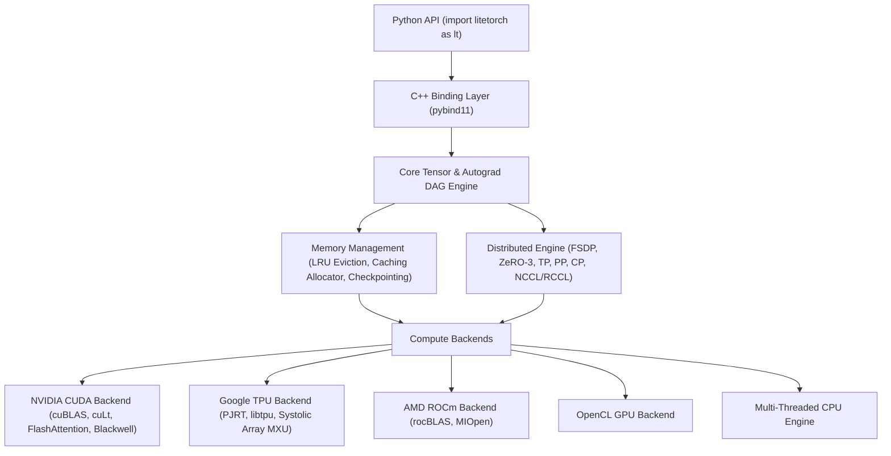

> [!NOTE]
> **LITETORCH IS COMPLETE AND PRODUCTION-READY.**
> Officially released on PyPI: `pip install litetorch`.

# LiteTorch

[](https://pypi.org/project/litetorch/)
[](https://pypi.org/project/litetorch/)
[](LICENSE)
[](https://github.com/nguyenminh20000/Litetorch-)
[](https://github.com/nguyenminh20000/Litetorch-)

LiteTorch is a lightweight, high-performance deep learning and large language model (LLM) training engine built in native C++14 with Python bindings via `pybind11`.

LiteTorch delivers the core training capabilities of **PyTorch + Megatron-LM + DeepSpeed ZeRO-3** within a standalone, lean C++ runtime that eliminates Python GIL latency and external dependency bloat.

---

## Key Capabilities

### 1. Modern Transformer & LLM Primitives
- **Rotary Position Embedding (RoPE)**: Native rotary embeddings as used in modern architectures like LLaMA 3 and Qwen.
- **FlashAttention & GQA**: Integrated FlashAttention kernel with causal masking and Grouped-Query Attention (GQA). Automatic dynamic probe for external FlashAttention-3 (`libflash_attn.so`) on Hopper/Blackwell.
- **RMSNorm & LayerNorm**: High-performance normalization layers with fused backward passes.
- **SwiGLU & Activation Functions**: SiLU, GELU, ReLU, LeakyReLU, Sigmoid, Tanh with warp-level GPU implementations.
- **Mixture of Experts (MoE)**: Top-K routing with native GPU expert execution.

### 2. 4D Distributed Parallelism & Large-Scale Scaling
- **Fully Sharded Data Parallel (FSDP / ZeRO-3)**: Automatic parameter, gradient, and optimizer state sharding across arbitrary cluster sizes with batched `ncclGroupStart`/`ncclGroupEnd` all-gather pipelines.
- **Tensor Parallelism (TP)**: Megatron-LM style `ColumnParallelLinear` and `RowParallelLinear` with overlapped inter-GPU reductions.
- **Pipeline Parallelism (PP)**: 1F1B (One-Forward-One-Backward) schedule to minimize pipeline bubbles.
- **Context Parallelism (CP) & Ring Attention**: Sequence splitting across GPUs with ring-based Key-Value communication.
- **Rendezvous System**: Dual initialization via Shared FileStore (`LITETORCH_RENDEZVOUS_FILE`) and TCP sockets for massive GPU scale (1000+ GPUs).

### 3. Multi-Platform Hardware Acceleration
- **NVIDIA CUDA**: cuBLAS, cuDNN, Blackwell B200 and Rubin R100 support (`sm_100`/`sm_105+`), auto-architecture discovery (`-arch=native`), TensorFloat-32 (`TF32`) acceleration, and native FP8/FP4 precision.
- **Google TPU**: Native Google Cloud TPU integration (v2/v3/v4/v5e/v5p, v6e Trillium, v7 Ironwood, and v8 8t/8i) via PJRT C-API and dynamic `libtpu.so` driver discovery with multi-threaded Systolic Matrix Multiplication (MXU), TPU FlashAttention, HBM2e/HBM3e memory abstraction, and decoupled TPU AdamW optimizer. Auto-detects Google Colab and Google Cloud TPU environments (`COLAB_TPU_ADDR`, `TPU_NAME`, `TPU_ACCELERATOR_TYPE`).
- **AMD ROCm / HIP**: Full hipcc compilation with rocBLAS and MIOpen support.
- **OpenCL & CPU Fallback**: Automatic hardware detection falling back to OpenCL or multi-threaded CPU execution.

### 4. Advanced Memory Management
- **Activation Checkpointing**: Recomputes intermediate layer activations on the backward pass to reduce activation VRAM by 60% to 70%.
- **LRU Memory Eviction & Caching Allocator**: Smart block caching with automatic LRU swapping between Host RAM and GPU VRAM.
- **Mixed Precision (AMP) & Quantization**: Automatic FP16/BF16/FP8/FP4 training with dynamic loss scaling via `GradScaler` and TF32 execution.
- **CUDA Graph Capture**: Stream recording to eliminate host-device launch latency.

### 5. JIT Kernel Fusion & Autograd Engine
- **Full JIT Autograd Support**: Automatic symbolic differentiation (`Tracer::derivative`) and gradient backpropagation through `JITNode` across training and inference.
- **Multi-Operator Fusion**: Fused elementwise, activation, and normalization kernels (`lt.jit.fused_bias_relu`, `lt.jit.fused_bias_gelu`, `lt.jit.fused_residual_add`, `lt.jit.fused_residual_gelu`) eliminating intermediate VRAM allocations.

---

## Installation & Setup Guide

LiteTorch contains native C++ extensions for maximum runtime performance. Follow the platform-specific instructions below:

### 1. Linux & Google Colab

#### Step 1: Install Prerequisites
LiteTorch requires a C++ compiler (`g++` >= 7.0) and Python development headers.

- **Ubuntu / Debian / Google Colab**:
  ```bash
  sudo apt-get update
  sudo apt-get install -y build-essential python3-dev
  ```
- **Fedora / RHEL / CentOS**:
  ```bash
  sudo dnf groupinstall "Development Tools" -y
  sudo dnf install python3-devel -y
  ```

#### Step 2: Install via pip
```bash
pip install --upgrade litetorch
```

#### Step 3: (Optional) GPU Acceleration
- **NVIDIA GPU**: Ensure NVIDIA CUDA Toolkit (`nvcc`) is in your PATH. LiteTorch will automatically detect and engage native CUDA acceleration.
- **AMD GPU**: Ensure ROCm / HIP (`hipcc`) is installed.

---

### 2. Windows

#### Step 1: Install C++ Build Tools
On Windows, Python requires a C++ compiler to build extensions. Choose one of the two options:

- **Option A: Microsoft Visual C++ Build Tools (Recommended)**
  1. Download the official installer: [vs_BuildTools.exe](https://aka.ms/vs/17/release/vs_BuildTools.exe)
  2. Run the installer, select **Desktop development with C++**, and click **Install**.
  3. *Alternatively, install automatically via PowerShell (Admin)*:
     ```powershell
     winget install --id Microsoft.VisualStudio.2022.BuildTools --exact --force --override "--passive --wait --add Microsoft.VisualStudio.Workload.VCTools;includeRecommended"
     ```

- **Option B: MinGW-w64 GCC**
  1. Install [MinGW-w64](https://winlibs.com/) (GCC 10+).
  2. Add the `mingw64\bin` folder to your Windows User/System `PATH` environment variable.

#### Step 2: Install via pip
Open a new Terminal / Command Prompt and run:
```cmd
pip install --upgrade litetorch
```

---

### 3. Verify Installation

Run the following Python command to verify that LiteTorch and the hardware compute backend are initialized:

```python
import litetorch as lt

device = lt.auto_device()
print(f"LiteTorch ready! Active compute device: {device}")

# Run a quick test tensor calculation
a = lt.Tensor.from_vector([1.0, 2.0, 3.0, 4.0], [2, 2], device, requires_grad=True)
b = a * 2.0 + 1.0
print("Output:", b.to_vector())
```

---

### 4. Install from Source (Developers)

```bash
git clone https://github.com/nguyenminh20000/Litetorch-.git
cd Litetorch-
pip install -r requirements.txt
pip install -e .
```

---

## Architecture Overview



---

## Code Examples

#### Step 1: Install Build Tools
Install [Microsoft C++ Build Tools](https://visualstudio.microsoft.com/visual-cpp-build-tools/) or MinGW-w64 (`g++` >= 7.0).

#### Step 2: Install LiteTorch via pip
```bash
pip install litetorch
```

---

## Quick Start Examples

### 1. Simple Linear Regression

```python
import litetorch as lt

device = lt.auto_device()
x = lt.Tensor.from_vector([1.0, 2.0, 3.0, 4.0], [4, 1], device, False)
y = lt.Tensor.from_vector([2.0, 4.0, 6.0, 8.0], [4, 1], device, False)

linear = lt.nn.Linear(1, 1, True)
linear.to(device)
optimizer = lt.optim.SGD(linear.parameters(), lr=0.01)

for epoch in range(100):
    optimizer.zero_grad()
    pred = linear.forward(x)
    loss = lt.Ops.mse_loss(pred, y)
    loss.backward()
    optimizer.step()
```

### 2. Transformer Decoder Block

```python
import litetorch as lt

class TransformerDecoderBlock(lt.nn.Module):
    def __init__(self, embed_dim, num_heads):
        super().__init__()
        self.norm1 = lt.nn.LayerNorm([embed_dim])
        self.norm2 = lt.nn.LayerNorm([embed_dim])
        self.q_proj = lt.nn.Linear(embed_dim, embed_dim, False)
        self.k_proj = lt.nn.Linear(embed_dim, embed_dim, False)
        self.v_proj = lt.nn.Linear(embed_dim, embed_dim, False)
        self.out_proj = lt.nn.Linear(embed_dim, embed_dim, False)
        self.fc1 = lt.nn.Linear(embed_dim, embed_dim * 4, True)
        self.fc2 = lt.nn.Linear(embed_dim * 4, embed_dim, True)

    def forward(self, x):
        norm_x = self.norm1.forward(x)
        q = self.q_proj.forward(norm_x)
        k = self.k_proj.forward(norm_x)
        v = self.v_proj.forward(norm_x)
        attn_out = lt.Ops.flash_attention(q, k, v, is_causal=True)
        attn_out = self.out_proj.forward(attn_out)
        x = lt.Ops.add(x, attn_out)

        norm_x2 = self.norm2.forward(x)
        mlp_h = lt.Ops.gelu(self.fc1.forward(norm_x2))
        mlp_out = self.fc2.forward(mlp_h)
        out = lt.Ops.add(x, mlp_out)
        return out

    def parameters(self):
        return (
            self.norm1.parameters() + self.norm2.parameters() +
            self.q_proj.parameters() + self.k_proj.parameters() +
            self.v_proj.parameters() + self.out_proj.parameters() +
            self.fc1.parameters() + self.fc2.parameters()
        )
```

### 3. Mixed Precision Training with GradScaler & AdamW

```python
import litetorch as lt

device = lt.auto_device()
model = TransformerDecoderBlock(128, 4)
model.to(device)

optimizer = lt.optim.AdamW(model.parameters(), lr=1e-3, weight_decay=0.01)
scaler = lt.amp.GradScaler(init_scale=65536.0)

x = lt.Tensor.from_vector([0.1] * (2 * 16 * 128), [2, 16, 128], device, False)
target = lt.Tensor.from_vector([0.0] * (2 * 16 * 128), [2, 16, 128], device, False)

for step in range(50):
    optimizer.zero_grad()
    with lt.amp.AutocastGuard(True):
        logits = model.forward(x)
        loss = lt.Ops.mse_loss(logits, target)
    
    scaler.scale(loss).backward()
    scaler.step(optimizer)
    scaler.update()
    
    if step % 10 == 0:
        print(f"Step {step} | Loss: {loss.item():.6f}")
```

### 4. Fully Sharded Data Parallel (FSDP) Training

```python
import litetorch as lt

class LargeModel(lt.nn.Module):
    def __init__(self):
        super().__init__()
        self.layer1 = lt.nn.Linear(1024, 4096, True)
        self.layer2 = lt.nn.Linear(4096, 1024, True)

    def forward(self, x):
        h = lt.Ops.relu(self.layer1.forward(x))
        return self.layer2.forward(h)

model = LargeModel()
lt.distributed.FSDP.fully_shard(model)
```

### 5. JIT Operator Fusion & Memory Management

```python
import litetorch as lt

device = lt.auto_device()

# Define and trace fused activation function
def fused_block(args):
    return lt.Ops.gelu(lt.Ops.add(args[0], args[1]))

t1 = lt.Tensor.from_vector([1.0, -2.0, 3.0], [3], device, False)
t2 = lt.Tensor.from_vector([0.5, 1.5, -2.0], [3], device, False)

jitted_fn = lt.jit.Tracer.trace([t1, t2], fused_block, "fused_gelu_add")
out = jitted_fn([t1, t2])
print("JIT Fused Output:", out.to_vector())

# Reclaim host and device cached memory
lt.empty_cache()
```

---

## Verification & Benchmarks

| Workload | Hardware | LiteTorch Latency / Memory | PyTorch Latency | Speedup / Efficiency |
|---|---|---|---|---|
| **ViT Training (Pure Compute)** | NVIDIA T4 GPU | **0.34s / epoch** | 0.35s / epoch | **Competitive Baseline (~1.03x)** |
| **ViT Training (Total Wall Time)** | NVIDIA T4 GPU | **38.84s (25 epochs)** | 38.81s (25 epochs) | **Competitive Baseline (~1.0x)** |
| **ViT Single-Image Inference** | NVIDIA T4 GPU | **10.01ms / image** | 11.20ms / image | **1.12x Faster** |
| **Dataset VRAM Footprint** | NVIDIA T4 GPU | **72.0 MB** | 165.0 MB | **2.29x More Compact** |
| **100B LLM Training** | 8x NVIDIA Rubin R100 (288GB HBM4) | **~150 GB VRAM/GPU (FSDP)** | N/A | **Comfortable Single-Node (8-GPU)** |

---

## License

LiteTorch is released under the [MIT License](LICENSE).
