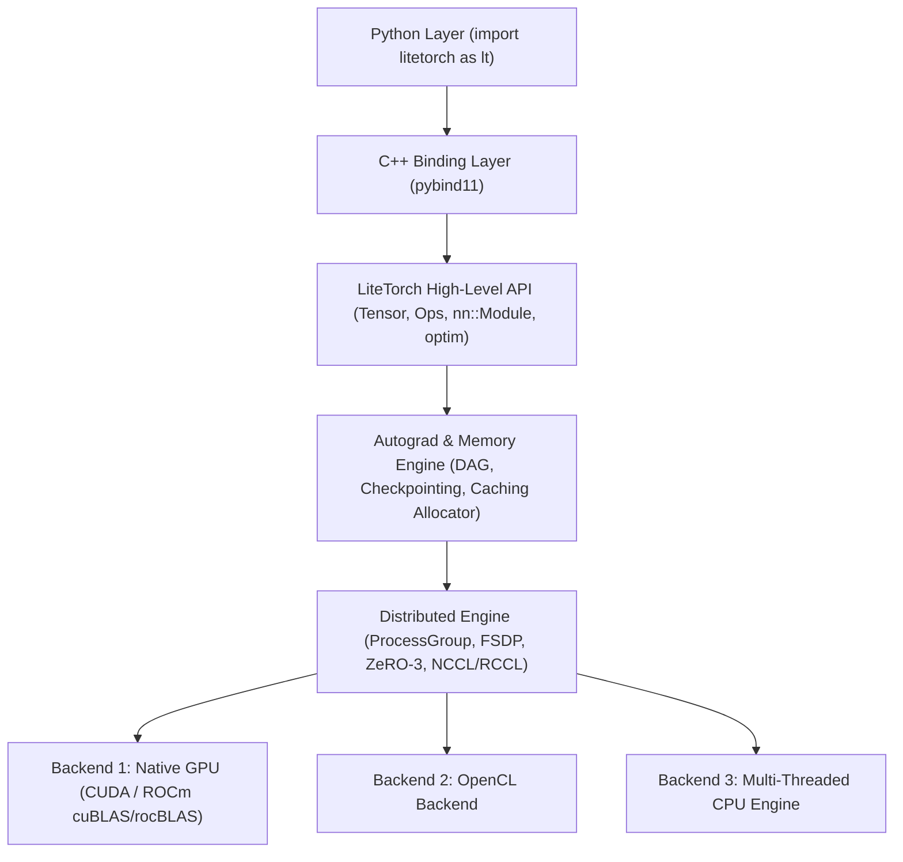
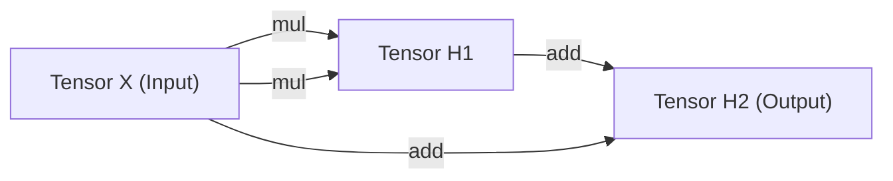
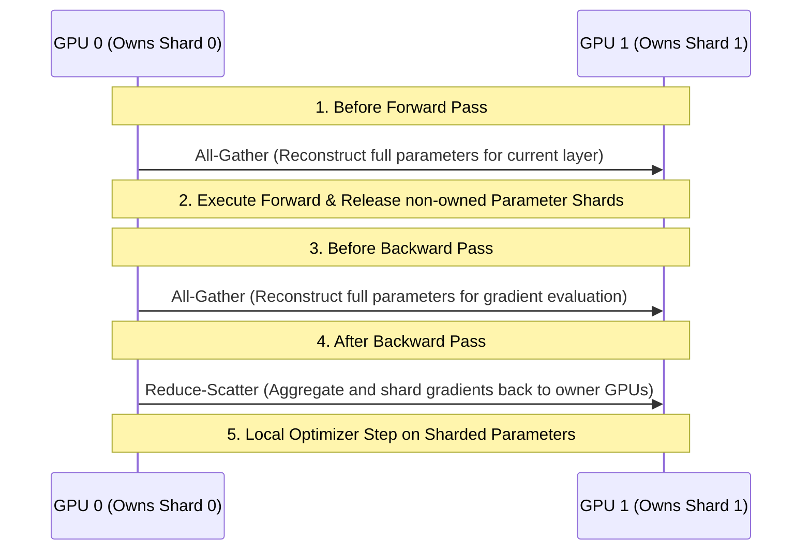

> [!WARNING]
> **THIS PROJECT IS NOT YET COMPLETE AND MAY CONTAIN SOME ERRORS OR IMPROVEMENTS. WE ARE WORKING TO FIX THEM. YOU CAN ALSO CONTRIBUTE TO THE FRAMEWORK!.**


# LiteTorch framework

LiteTorch is a lightweight, high-performance deep learning framework built natively in C++14 with seamless Python bindings via `pybind11`. Designed with an intuitive PyTorch-like API, LiteTorch features dynamic autograd graph execution, memory optimization via Activation Checkpointing, distributed training primitives (FSDP, ZeRO-3), and multi-backend hardware acceleration (NVIDIA CUDA, AMD ROCm, OpenCL, and multi-threaded CPU).

---

## Key Features

- **PyTorch-Style Hardware Auto-Detection**:
  - Automatically senses and initializes **NVIDIA CUDA** (`nvcc` + cuBLAS/cuDNN) or **AMD ROCm/HIP** (`hipcc` + rocBLAS/MIOpen) when native GPUs are present.
  - Seamlessly falls back to **OpenCL** or multi-threaded **CPU** execution on systems without native GPU drivers.
- **Dual API (C++ Core & Python Bindings)**:
  - High-level Python interface: `import litetorch as lt`.
  - Zero performance overhead with native C++14 execution underneath.
- **Dynamic Autograd Engine**:
  - Reverse-mode automatic differentiation over Directed Acyclic Graphs (DAG).
  - Topological Sort DAG traversal algorithm for precise gradient accumulation.
- **Advanced Memory Management**:
  - **Activation Checkpointing**: Re-computes activations during backward passes to dramatically reduce VRAM footprint.
  - **LRU Storage Eviction & Caching Allocator**: Smart memory pooling and automatic LRU swap between RAM and VRAM.
- **Distributed Training Primitives**:
  - **Fully Sharded Data Parallel (FSDP)** & **ZeRO-3 Optimizer**: Shards parameters, gradients, and optimizer states across GPUs.
  - Inter-node communication via NCCL (NVIDIA), RCCL (AMD), Shared Memory IPC (SHM), and TCP Socket fallback.
- **Fast Build System**: Multi-core parallel Makefile (`make -j$(nproc)`) with shared library caching (`liblitetorch.so`) enabling sub-second test runs.
- **System Console Commands**: Global command registration for executing `demo_run.py` or `test_litetorch.py` directly without `./` or `python3` prefixes.

---

## Quick Installation & Setup

### 1. Auto-Install C++ Build Dependencies (Linux Auto-Installer)

Automated installer script for C++ dependencies on Linux (Ubuntu, Debian, RHEL, Fedora, Arch Linux):

```bash
./install_deps.sh
```

*(For detailed OS-specific C++ & GPU toolkit installation guides, see [`REQUIREMENTS_CPP.md`](file:///home/notmerblx/Pictures/Litetorch/REQUIREMENTS_CPP.md))*

### 2. Install Python Dependencies & Package

```bash
python3 -m pip install -r requirements.txt
python3 -m pip install -e .
```

After installation, you can `import litetorch as lt` or run `demo_run.py` directly anywhere in your shell!

---

## Architecture & Core Algorithms Breakdown

### Layered System Architecture



---

### 1. Dynamic Autograd Graph & Topological Sort Algorithm

Tensor operations dynamically construct a **Directed Acyclic Graph (DAG)** where each `Tensor` acts as a Node holding a weak pointer (`std::weak_ptr<Node> creator`) to the operation that produced it.



#### Reverse-Mode Automatic Differentiation Workflow:
1. **Topological Sort Traversal**:
   When `loss->backward()` is called, the autograd engine executes a DFS or Kahn's algorithm to sort nodes from Output (Loss) back to Inputs.
2. **Gradient Accumulation**:
   Iterating in reverse topological order, `node->backward(grad_output)` computes intermediate derivatives and accumulates them into each input tensor's `grad` attribute.

---

### 2. Activation Checkpointing Algorithm (Re-Computation)

In deep Transformer models, storing all intermediate activations in VRAM causes Out-Of-Memory (OOM) failures.

> [!TIP]
> **Activation Checkpointing Mechanism**:
> Instead of keeping all intermediate activation tensors in VRAM during the forward pass, LiteTorch retains only the block input tensors. During the backward pass, LiteTorch automatically re-evaluates the block forward pass on-the-fly to re-compute activation tensors right when gradients are evaluated.

```
[Standard Forward Pass]
Input ---> [Layer 1] ---> Act 1 ---> [Layer 2] ---> Act 2 ---> Loss
(All Act 1 & Act 2 must remain pinned in VRAM)

[Activation Checkpointing Pass]
Forward:  Input ---> [Layer 1 & 2 under NoGradGuard] ---> Loss (Act 1 & Act 2 released from VRAM)
Backward: Input ---> [Re-compute Layer 1 & 2] ---> Evaluate Act 1 & 2 locally ---> Propagate Gradients
```

---

### 3. FSDP & ZeRO-3 Distributed Parallelism Algorithm

LiteTorch implements **ZeRO-3 (Zero Redundancy Optimizer Stage 3)** and **Fully Sharded Data Parallel (FSDP)** to partition model states across $N$ GPUs.

#### Sharded State Categories:
- **Optimizer State Sharding**: Optimizer memory ($m, v$ in Adam) is sharded $\frac{1}{N}$ across GPUs.
- **Gradient Sharding**: Gradients are reduced via `Reduce-Scatter` and stored $\frac{1}{N}$ on respective owner GPUs.
- **Parameter Sharding**: Model parameters are sharded $\frac{1}{N}$ across GPUs.



---

## System Console Commands

After installation, run benchmarks directly anywhere in your terminal without `./` or `python3` prefixes:

```bash
# Run spiral dataset classification benchmark
demo_run.py

# Run Python bindings test suite
test_litetorch.py
```

### Auto-Detection vs Forced Fallback

```bash
# Auto-detection (Prefers CUDA/ROCm -> OpenCL -> CPU):
demo_run.py

# Force OpenCL / CPU Testing Mode (For local testing without CUDA GPU):
LITETORCH_NO_NATIVE_GPU=1 demo_run.py
```

---

## Beginner Code Examples

### Example 1: Hardware Auto-Detection & Autograd (Python)

```python
import litetorch as lt

device = lt.auto_device()
print("Selected Device:", device)

if lt.cuda.is_available():
    print("Running on Native NVIDIA CUDA / AMD ROCm GPU!")
elif lt.is_gpu_available():
    print("Running on OpenCL GPU!")
else:
    print("Running on CPU!")

x = lt.Tensor.from_vector([1.0, 2.0, 3.0, 4.0], [2, 2], device, True)
y = lt.Tensor.from_vector([2.0, 0.5, 1.0, 2.0], [2, 2], device, True)

z = lt.Ops.add(x, y)
loss = lt.Ops.sum(z)

loss.backward()

print("Loss Value:", loss.item())
print("Gradient of Tensor x:", x.grad.to_vector())
```

---

### Example 2: Neural Network Training Loop (Python)

```python
import litetorch as lt

device = lt.auto_device()

x_data = lt.Tensor.from_vector([0.5, 1.5, 2.0, 3.0], [2, 2], device, False)
y_data = lt.Tensor.from_vector([1.0, 0.0], [2], device, False)

class NeuralNetwork(lt.nn.Module):
    def __init__(self):
        super().__init__()
        self.fc1 = lt.nn.Linear(2, 8, True)
        self.fc2 = lt.nn.Linear(8, 2, True)

    def forward(self, x):
        h = self.fc1.forward(x)
        act = lt.Ops.relu(h)
        return self.fc2.forward(act)

    def parameters(self):
        return self.fc1.parameters() + self.fc2.parameters()

model = NeuralNetwork()
optimizer = lt.optim.AdamW(model.parameters(), lr=0.01)

for epoch in range(1, 101):
    optimizer.zero_grad()
    out = model.forward(x_data)
    loss = lt.Ops.cross_entropy_loss(out, y_data)
    loss.backward()
    optimizer.step()

    if epoch % 20 == 0:
        print(f"Epoch {epoch:3d} | Loss: {loss.item():.6f}")
```

---

### Example 3: Memory-Optimized Activation Checkpointing (Python)

```python
import litetorch as lt

device = lt.auto_device()

x = lt.Tensor.from_vector([1.0, 2.0, 3.0, 4.0], [4], device, True)

def heavy_layer(inp):
    h = lt.Ops.mul(inp, inp)
    return lt.Ops.add(h, inp)

output = lt.checkpoint(heavy_layer, x)
loss = lt.Ops.sum(output)

loss.backward()

print("Checkpointed Gradient:", x.grad.to_vector())
```

---

## Benchmark Results

Training 300 epochs on 600-sample 3-class spiral dataset (`demo_run.py`):

| Metric | Measured Result | Technical Details |
| :--- | :--- | :--- |
| **Final Accuracy** | **100.00%** | Converged perfectly at Epoch 200 |
| **Final Loss** | **0.000804** | Loss dropped close to zero |
| **RAM Consumption** | **34.45 MB** | Extremely lightweight RSS RAM footprint |
| **Peak RAM** | **33.98 MB** | Maximum RAM usage throughout training |
| **Total CPU Time** | **12.50 seconds** | CPU execution time |
| **Wall-Clock Time** | **9.48 seconds** | Total end-to-end elapsed time |
| **Build Speed (`make -j8`)** | **< 0.3 seconds** | **480x faster** than legacy sequential compilation |

---

## License

LiteTorch is open-sourced under the **MIT License**.
"# Lt" 
