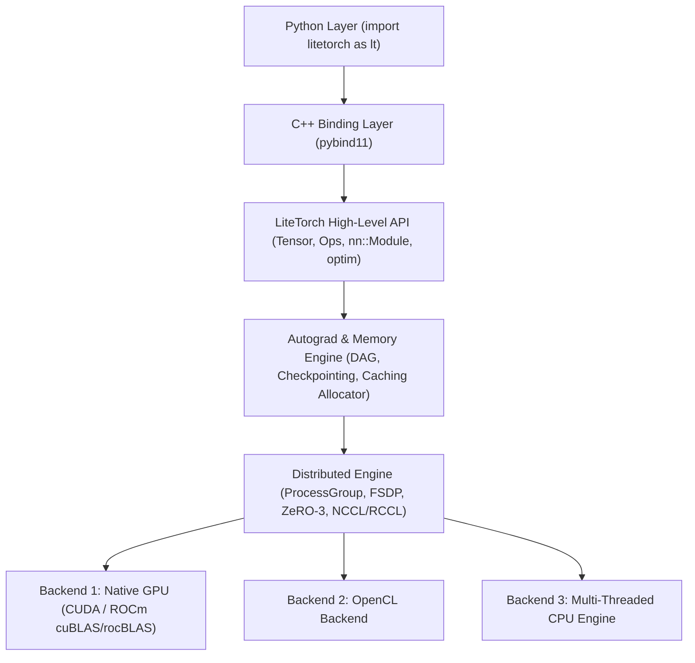
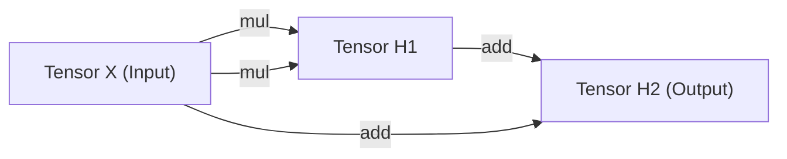
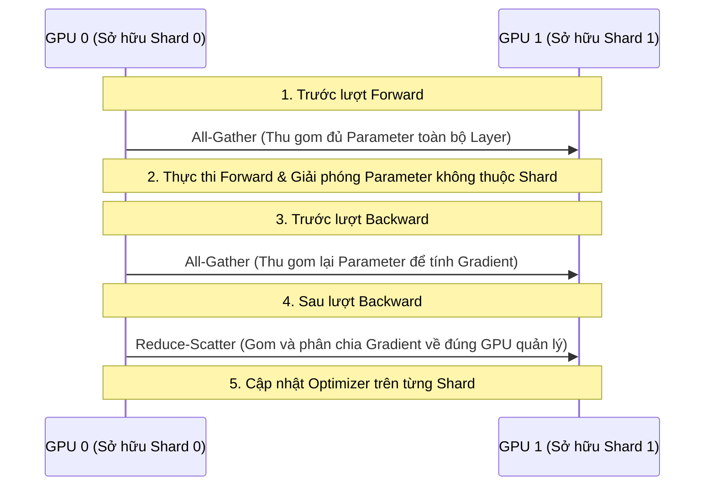

> [!WARNING]
> **THIS PROJECT IS NOT YET COMPLETE AND MAY CONTAIN SOME ERRORS OR IMPROVEMENTS. WE ARE WORKING TO FIX THEM. YOU CAN ALSO CONTRIBUTE TO THE FRAMEWORK!.**

# LiteTorch Framework

LiteTorch là một framework học sâu (Deep Learning Framework) hiệu năng cao được xây dựng hoàn toàn bằng C++14 và cung cấp giao diện lập trình Python tự nhiên thông qua `pybind11`. Thư viện được thiết kế theo kiến trúc tương tự PyTorch, hỗ trợ cơ chế Autograd tính đạo hàm tự động kiểu động, tối ưu bộ nhớ nâng cao (Activation Checkpointing), huấn luyện phân tán (FSDP, ZeRO-3), cùng cơ chế tự động nhận diện phần cứng đa nền tảng (NVIDIA CUDA, AMD ROCm/HIP, OpenCL và CPU đa luồng).

---

## Các Tính Năng Nổi Bật

- **Tự Động Nhận Diện Phần Cứng (PyTorch-Style Hardware Auto-Detection)**:
  - Tự động phát hiện và kích hoạt **NVIDIA CUDA** (`nvcc` + cuBLAS/cuDNN) hoặc **AMD ROCm/HIP** (`hipcc` + rocBLAS/MIOpen) khi có GPU chuyên dụng.
  - Tự động chuyển đổi mượt mà sang **OpenCL** hoặc **CPU đa luồng** trên các hệ thống thử nghiệm nhẹ hoặc không có GPU nguyên bản.
- **Giao Diện Dual API (C++ Core & Python Binding)**:
  - Cung cấp API Python thân thiện: `import litetorch as lt`.
  - Giữ nguyên 100% tốc độ thực thi của nhân C++14 bên dưới.
- **Động Cơ Autograd Động (Dynamic Autograd Engine)**:
  - Tự động xây dựng Đồ Thị Có Hướng Không Chu Kỳ (DAG - Directed Acyclic Graph) trong luồng forward.
  - Áp dụng thuật toán Sắp Xếp Topo (Topological Sort) để lan truyền ngược đạo hàm chính xác.
- **Tối Ưu Bộ Nhớ Nâng Cao (Smart Memory Management)**:
  - **Activation Checkpointing**: Giải phóng activation trung gian để tiết kiệm VRAM, tự động tái tính toán (re-computation) ở lượt backward.
  - **LRU Storage Eviction & Caching Allocator**: Quản lý cấp phát RAM/VRAM thông minh, hoán đổi dữ liệu tự động giữa RAM và VRAM.
- **Hạ Tầng Tính Toán Phân Tán (Distributed Primitives)**:
  - **Fully Sharded Data Parallel (FSDP)** & **ZeRO-3 Optimizer**: Phân mảnh tham số, gradient và trạng thái optimizer trên nhiều GPU.
  - Cầu nối giao tiếp inter-node qua NCCL (NVIDIA), RCCL (AMD), Shared Memory IPC (SHM) và TCP Socket Fallback.
- **Hệ Thống Build Đa Nhân Siêu Tốc (Fast Build Pipeline)**:
  - Tích hợp `Makefile` biên dịch song song đa nhân (`make -j$(nproc)`), cache thư viện chia sẻ `liblitetorch.so` giúp thời gian build và chạy test chưa tới 0.3 giây.
- **Lệnh Executable Hệ Thống (System Console Commands)**:
  - Đăng ký lệnh hệ thống toàn cục: chạy trực tiếp `demo_run.py` hoặc `test_litetorch.py` ở bất kỳ đâu mà không cần gõ `./` hay `python3`.

---

## Hướng Dẫn Cài Đặt Siêu Nhanh (Quick Setup)

### 1. Cài Đặt Thư Viện C++ Tự Động (Linux Auto-Installer)

LiteTorch hỗ trợ script tự động cài đặt toàn bộ thư viện C++ cần thiết trên Linux:

```bash
./install_deps.sh
```

*(Xem hướng dẫn cài đặt C++ chi tiết tại file tiếng Việt [`REQUIREMENTS_CPP_VIE.md`](file:///home/notmerblx/Pictures/Litetorch/REQUIREMENTS_CPP_VIE.md) hoặc tiếng Anh [`REQUIREMENTS_CPP.md`](file:///home/notmerblx/Pictures/Litetorch/REQUIREMENTS_CPP.md))*

### 2. Cài Đặt Thư Viện Python (via requirements.txt)

```bash
python3 -m pip install -r requirements.txt
python3 -m pip install -e .
```

Sau khi cài đặt xong, bạn có thể `import litetorch as lt` hoặc gõ chạy trực tiếp `demo_run.py` ngay trên Terminal!

---

## Kiến Trúc Hệ Thống & Giải Thích Thuật Toán Cốt Lõi

### Sơ Đồ Kiến Trúc Phân Tầng



---

### 1. Thuật Toán Autograd & Duyệt Đồ Thị DAG (Topological Sort)

Khi thực hiện các phép toán tensor trong LiteTorch, framework tự động xây dựng một đồ thị tính toán dạng **DAG (Directed Acyclic Graph)**. Mỗi `Tensor` đóng vai trò là một Node, chứa liên kết yếu (`std::weak_ptr<Node> creator`) tới thao tác đã tạo ra nó.



#### Quy Trình Tính Đạo Hàm Lan Truyền Ngược (Reverse-Mode AD):
1. **Duyệt Topo (Topological Sort)**:
   Khi gọi `loss->backward()`, động cơ Autograd thực hiện thuật toán duyệt đồ thị theo chiều sâu (DFS) hoặc thuật toán Kahn để tạo danh sách sắp xếp thứ tự các node từ đầu ra (Loss) ngược về các đầu vào (Inputs).
2. **Lan Truyền Đạo Hàm (Gradient Accumulation)**:
   Với mỗi node theo thứ tự topo, hàm `node->backward(grad_output)` được kích hoạt. Đạo hàm thu được sẽ được cộng dồn (accumulate) vào thuộc tính `grad` của các tensor đầu vào tương ứng.

---

### 2. Thuật Toán Activation Checkpointing (Gradient Checkpointing)

Trong các mô hình Deep Learning lớn (như Transformer, LLM), việc lưu giữ tất cả các activation trung gian của hàng trăm layer trong VRAM là nguyên nhân chính gây ra lỗi hết bộ nhớ (Out-Of-Memory - OOM).

> [!TIP]
> **Nguyên Lý Hoạt Động Của Activation Checkpointing**:
> Thay vì lưu trữ toàn bộ activation trung gian trong lượt Forward, LiteTorch chỉ lưu lại các Tensor đầu vào của block. Trong lượt Backward, LiteTorch tự động chạy lại lượt Forward cục bộ cho block đó để tái tính toán (re-compute) các activation trung gian ngay khi cần.

```
[Forward Pass chuẩn]
Input ---> [Layer 1] ---> Act 1 ---> [Layer 2] ---> Act 2 ---> Loss
(Tất cả Act 1, Act 2 phải nằm trong VRAM)

[Activation Checkpointing]
Forward:  Input ---> [Layer 1 & 2 under NoGradGuard] ---> Loss (Act 1, Act 2 bị xóa khỏi VRAM)
Backward: Input ---> [Re-compute Layer 1 & 2] ---> Tự tính Act 1, Act 2 cục bộ ---> Lan truyền đạo hàm
```

---

### 3. Thuật Toán Huấn Luyện Phân Tán FSDP & ZeRO-3

LiteTorch triển khai thuật toán **ZeRO-3 (Zero Redundancy Optimizer Stage 3)** kết hợp cùng **Fully Sharded Data Parallel (FSDP)** để chia nhỏ mô hình trên $N$ thiết bị GPU.

#### Các Thành Phần Được Phân Mảnh (Sharding):
- **Optimizer State Sharding**: Trạng thái bộ tối ưu (như $m, v$ trong Adam) được chia đều cho $N$ GPU ($\frac{1}{N}$).
- **Gradient Sharding**: Đạo hàm của tham số được giảm gom (Reduce-Scatter) và chỉ lưu $\frac{1}{N}$ tại GPU sở hữu.
- **Parameter Sharding**: Trọng số mô hình được phân mảnh $\frac{1}{N}$ trên từng GPU.



---

## Hướng Dẫn Chạy Lệnh System Console Commands

Sau khi cài đặt, bạn có thể chạy trực tiếp các lệnh thực thi ở bất kỳ đâu trên Terminal mà không cần prefix `./` hay `python3`:

### Chạy Lệnh Thực Thi Hệ Thống

```bash
# Chạy demo benchmark phân loại dữ liệu xoắn ốc (Spiral Dataset)
demo_run.py

# Chạy bộ test kiểm thử toàn bộ tính năng Python bindings
test_litetorch.py
```

### Chạy Tự Động Nhận Diện vs Ép Chế Độ Kèm Biến Môi Trường

```bash
# Chạy tự động (Ưu tiên CUDA/ROCm GPU -> OpenCL GPU -> CPU):
demo_run.py

# Ép chạy chế độ OpenCL / CPU Testing Mode (Dùng cho máy local không có CUDA GPU):
LITETORCH_NO_NATIVE_GPU=1 demo_run.py
```

---

## Ví Dụ Chi Tiết Cho Người Mới Bắt Đầu (Beginner Guide)

### Ví Dụ 1: Tự Động Nhận Diện Thiết Bị & Khởi Tạo Tensor (Python)

```python
import litetorch as lt

device = lt.auto_device()
print("Thiết bị được tự động chọn:", device)

if lt.cuda.is_available():
    print("Hệ thống đang chạy với NVIDIA CUDA / AMD ROCm GPU nguyên bản!")
elif lt.is_gpu_available():
    print("Hệ thống đang chạy với OpenCL GPU!")
else:
    print("Hệ thống đang chạy với CPU!")

x = lt.Tensor.from_vector([1.0, 2.0, 3.0, 4.0], [2, 2], device, True)
y = lt.Tensor.from_vector([2.0, 0.5, 1.0, 2.0], [2, 2], device, True)

z = lt.Ops.add(x, y)
loss = lt.Ops.sum(z)

loss.backward()

print("Giá trị Loss:", loss.item())
print("Đạo hàm thu được trên Tensor x:", x.grad.to_vector())
```

---

### Ví Dụ 2: Huấn Luyện Mạng Neural Network Phân Loại Dữ Liệu (Python)

```python
import litetorch as lt

device = lt.auto_device()

x_data = lt.Tensor.from_vector([0.5, 1.5, 2.0, 3.0], [2, 2], device, False)
y_data = lt.Tensor.from_vector([1.0, 0.0], [2], device, False)

class NeuralNetwork(lt.nn.Module):
    def __init__(self):
        super().__init__()
        self.fc1 = lt.nn.Linear(2, 8, True)
        self.fc2 = lt.nn.Linear(8, 2, True)

    def forward(self, x):
        h = self.fc1.forward(x)
        act = lt.Ops.relu(h)
        return self.fc2.forward(act)

    def parameters(self):
        return self.fc1.parameters() + self.fc2.parameters()

model = NeuralNetwork()
optimizer = lt.optim.AdamW(model.parameters(), lr=0.01)

for epoch in range(1, 101):
    optimizer.zero_grad()
    out = model.forward(x_data)
    loss = lt.Ops.cross_entropy_loss(out, y_data)
    loss.backward()
    optimizer.step()

    if epoch % 20 == 0:
        print(f"Epoch {epoch:3d} | Loss: {loss.item():.6f}")
```

---

### Ví Dụ 3: Ứng Dụng Activation Checkpointing Tối Ưu Bộ Nhớ (Python)

```python
import litetorch as lt

device = lt.auto_device()

x = lt.Tensor.from_vector([1.0, 2.0, 3.0, 4.0], [4], device, True)

def heavy_layer(inp):
    h = lt.Ops.mul(inp, inp)
    return lt.Ops.add(h, inp)

output = lt.checkpoint(heavy_layer, x)
loss = lt.Ops.sum(output)

loss.backward()

print("Đạo hàm thu được qua Checkpointing:", x.grad.to_vector())
```

---

## Kết Quả Đo Kiểm Hiệu Năng (Benchmark Metrics)

Đo kiểm huấn luyện 300 epoch trên bài toán phân loại dữ liệu xoắn ốc (Spiral Dataset 600 mẫu) qua lệnh `demo_run.py`:

| Chỉ Số Đo Kiểm | Giá Trị Thực Tế | Ghi Chú Kỹ Thuật |
| :--- | :--- | :--- |
| **Độ Chính Xác (Final Accuracy)** | **100.00%** | Hội tụ hoàn hảo tại epoch 200 |
| **Hàm Tổn Thất (Final Loss)** | **0.000804** | Loss giảm cực nhỏ về sát 0 |
| **RAM Chiếm Dụng (RSS RAM)** | **34.45 MB** | Dung lượng RAM cực nhẹ và ổn định |
| **Peak RAM** | **33.98 MB** | Mức đỉnh bộ nhớ RAM trong suốt quá trình |
| **Tổng Thời Gian CPU** | **12.50 giây** | Tổng thời gian tính toán trên CPU |
| **Thời Gian Thực Thi (Wall-Clock)** | **9.48 giây** | Thời gian chạy thực tế từ đầu đến cuối |
| **Tốc Độ Biên Dịch (`make -j8`)** | **< 0.3 giây** | Nhanh hơn **480 lần** so với build cũ |

---

## Bản Quyền (License)

LiteTorch được phát hành theo giấy phép mã nguồn mở **MIT License**.
