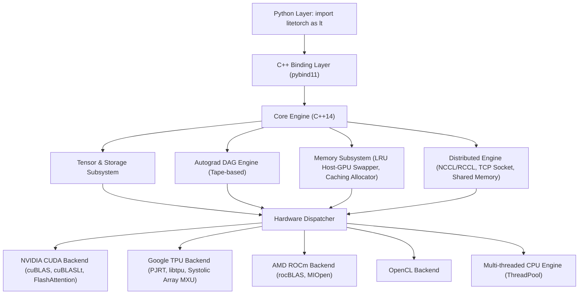

# 1. LiteTorch Technical Documentation

LiteTorch is a lightweight, high-performance deep learning framework and large language model (LLM) training runtime built in native C++14 with Python bindings via `pybind11`.

This documentation suite provides complete end-to-end guides covering core foundations, model architectures, memory management, 4D distributed parallelism, and LLM serving.

---

## 1.1. Documentation Index

| Index | Title | File Name | Description |
| :--- | :--- | :--- | :--- |
| 1 | Documentation Overview | [1.index.md](1.index.md) | Architecture overview, navigation table, and design principles |
| 2 | Installation Guide | [2.installation.md](2.installation.md) | Setup instructions for Linux, Windows, Colab, GPU, and source build |
| 3 | Quickstart Guide | [3.quickstart.md](3.quickstart.md) | Rapid onboarding: Tensors, autograd, custom modules, dataloaders, and training loops |
| 4 | Tensor & Autograd | [4.tensor_and_autograd.md](4.tensor_and_autograd.md) | StorageImpl memory engine, device management, strides, and tape-based Autograd DAG |
| 5 | Operators Reference | [5.operators.md](5.operators.md) | Full API reference for mathematical, reduction, activation, vision, loss, and LLM ops |
| 6 | Neural Networks | [6.neural_networks.md](6.neural_networks.md) | Object-oriented neural network modules: Linear, Conv, MoE, QLoRA, Attention, Loss |
| 7 | Optimizers & AMP | [7.optimizers_and_amp.md](7.optimizers_and_amp.md) | Optimizers (SGD, AdamW, 8-bit, FP8, ZeRO-3) and Automatic Mixed Precision |
| 8 | Distributed Training | [8.distributed_training.md](8.distributed_training.md) | 4D Parallelism: FSDP (ZeRO-3), Tensor Parallelism, Pipeline 1F1B, Context Parallelism |
| 9 | LLM Serving & Inference | [9.llm_serving.md](9.llm_serving.md) | PagedAttention, Continuous Batching, KV-Cache, Speculative Engine, Medusa, Guided Decoding |
| 10 | Quantization & JIT | [10.quantization_and_jit.md](10.quantization_and_jit.md) | Post-training quantization, QATLinear, W8A8 matmul, JIT tracer, and compilation |
| 11 | Data & Serialization | [11.data_and_io.md](11.data_and_io.md) | Dataset, DataLoader, state checkpointing, and module serialization |
| 12 | Native C++ API Guide | [12.cpp_api.md](12.cpp_api.md) | Pure C++ integration, headers, CMake setup, and custom module implementation |

---

## 1.2. Architecture Overview

---

## 1.3. Key Capabilities

1. **Standalone High-Performance C++ Core**: Zero Python Global Interpreter Lock (GIL) latency and self-contained runtime.
2. **Modern LLM Kernels**: Built-in support for FlashAttention, Grouped-Query Attention (GQA), Rotary Position Embedding (RoPE), SwiGLU, RMSNorm, and PagedAttention.
3. **4D Distributed Scaling**:
   - Fully Sharded Data Parallel (FSDP / ZeRO-3)
   - Tensor Parallelism (TP)
   - Pipeline Parallelism (PP 1F1B)
   - Context Parallelism (CP / Ring Attention)
4. **Optimized Memory Management**:
   - Caching Block Allocator reducing device allocation overhead.
   - Automatic LRU memory eviction swapping between Host RAM and Device VRAM.
   - Activation Checkpointing reducing backward activation memory by 60% to 70%.
5. **Multi-Platform Hardware Acceleration**: Automatic hardware detection for NVIDIA CUDA, Google Cloud TPU (v2-v5p, v6e Trillium, v7 Ironwood, v8 8t/8i via PJRT and `libtpu.so`), AMD ROCm, OpenCL, and multi-threaded CPU fallback.
