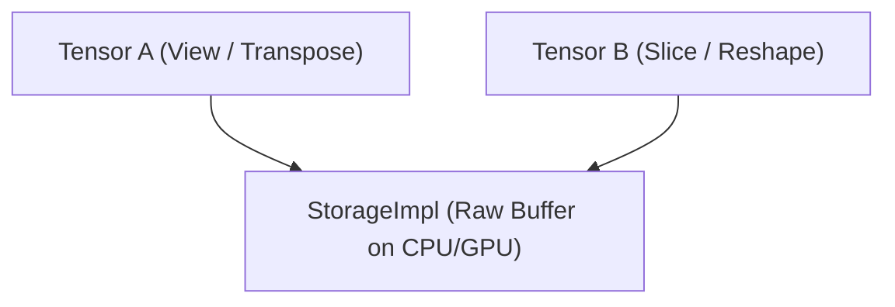

# 4. Tensor Architecture and Autograd Engine

This document details the memory management architecture of `Tensor`, data type representations, device placement, strided layouts, and the automatic differentiation (Autograd DAG) engine in LiteTorch.

---

## 4.1. Memory Architecture: StorageImpl vs. Tensor

LiteTorch strictly separates the physical data buffer (`StorageImpl`) from logical tensor views (`Tensor`):



- **`StorageImpl`**: Owns raw buffer pointers on CPU (`cpu_data`) or GPU (`gpu_data`), and interfaces with `MemoryManager` to handle LRU host-device swapping when GPU VRAM exceeds defined thresholds.
- **`Tensor`**: Encapsulates n-dimensional metadata: `shape`, `strides`, `offset`, `dtype`, `device`, gradient flag `requires_grad`, gradient pointer `grad`, and graph dependency node `creator`.

---

## 4.2. Data Types System

LiteTorch supports floating-point, integer, and quantized data types defined in `lt.DataType`:

| Data Type Enum | Size (Bytes) | Primary Application |
| :--- | :--- | :--- |
| `lt.DataType.FP64` | 8 | Double precision scientific computing |
| `lt.DataType.FP32` | 4 | Standard single precision training |
| `lt.DataType.FP16` | 2 | Half-precision memory-efficient training |
| `lt.DataType.BF16` | 2 | LLM training with high dynamic range |
| `lt.DataType.INT16` | 2 | 16-bit signed integer operations |
| `lt.DataType.INT8` | 1 | 8-bit integer quantization |
| `lt.DataType.INT4` | 0.5 | 4-bit packed weights |
| `lt.DataType.FP8_E4M3` | 1 | NVIDIA Hopper/Blackwell FP8 forward pass |
| `lt.DataType.FP8_E5M2` | 1 | FP8 format with larger dynamic range for gradients |
| `lt.DataType.NF4` | 0.5 | NormalFloat4 for QLoRA |
| `lt.DataType.FP4_E2M1` | 0.5 | NVFP4 E2M1 for NVIDIA Blackwell B200 |

Cast between data types using `.cast()`:

```python
import litetorch as lt

device = lt.auto_device()
x = lt.Tensor.from_vector([1.0, 2.0, 3.0, 4.0], [2, 2], device, False, lt.DataType.FP32)
x_half = x.cast(lt.DataType.FP16)
print("New data type:", x_half.dtype)
```

---

## 4.3. Compute Devices

LiteTorch supports 4 device types:

- `lt.DeviceType.CPU`: CPU execution via multi-threaded native ThreadPool.
- `lt.DeviceType.GPU`: GPU execution (NVIDIA CUDA, AMD ROCm, or OpenCL).
- `lt.DeviceType.TPU`: Google Cloud TPU execution (v2-v5p, v6e Trillium, v7 Ironwood, v8 8t/8i via PJRT / `libtpu.so` Systolic MXU).
- `lt.DeviceType.META`: Virtual device without memory allocation, used for topology synthesis.

```python
import litetorch as lt

cpu_dev = lt.Device(lt.DeviceType.CPU, 0)
gpu_dev = lt.Device(lt.DeviceType.GPU, 0)
tpu_dev = lt.Device(lt.DeviceType.TPU, 0)

x_cpu = lt.Tensor.from_vector([1.0, 2.0], [2], cpu_dev, False)
x_gpu = x_cpu.to(gpu_dev)
x_tpu = x_cpu.to(tpu_dev)
```

---

## 4.4. Strides, Views, and Contiguity

Zero-copy memory transformations are implemented via strided indexing:

```python
import litetorch as lt

device = lt.auto_device()
x = lt.Tensor.from_vector([1.0, 2.0, 3.0, 4.0, 5.0, 6.0], [2, 3], device, False)

print("Original shape:", x.shape)
print("Original strides:", x.strides)

x_transposed = x.transpose(0, 1)
print("Transposed shape:", x_transposed.shape)
print("Transposed strides:", x_transposed.strides)

x_contiguous = x_transposed.contiguous()
print("Contiguous strides:", x_contiguous.strides)

x_view = x.view([3, 2])
print("View shape:", x_view.shape)
```

---

## 4.5. Tape-based Autograd DAG Engine

LiteTorch records a Directed Acyclic Graph (DAG) during the forward pass.

### 4.5.1. Computational Nodes and SavedTensor
- Each operation instantiates a C++ `Node` containing backward gradient closures.
- Intermediate tensors required for backpropagation are held in `SavedTensor` using `std::weak_ptr<Tensor>` to prevent reference cycles and memory leaks.

### 4.5.2. First-Order Gradients

```python
import litetorch as lt

device = lt.auto_device()

x = lt.Tensor.from_vector([2.0, 3.0], [2], device, True)
w = lt.Tensor.from_vector([4.0, 5.0], [2], device, True)

y = lt.Ops.mul(x, w)
loss = lt.Ops.sum(y)

loss.backward()

print("Gradient x.grad:", x.grad.to_vector())
print("Gradient w.grad:", w.grad.to_vector())
```

### 4.5.3. Higher-Order Gradients (Double Backward)
Pass `create_graph=True` into `backward()` to record backward operations into the DAG:

```python
import litetorch as lt

device = lt.auto_device()

x = lt.Tensor.from_vector([3.0], [1], device, True)
y = lt.Ops.mul(x, x)

y.backward(create_graph=True)
print("First derivative dy/dx:", x.grad.to_vector())
```

### 4.5.4. Registering Backward Hooks

```python
import litetorch as lt

device = lt.auto_device()

x = lt.Tensor.from_vector([1.0, 2.0], [2], device, True)

def custom_hook(grad):
    scale = lt.Tensor.from_vector([2.0, 2.0], [2], device, False)
    return lt.Ops.mul(grad, scale)

x.register_hook(custom_hook)

y = lt.Ops.sum(x)
y.backward()

print("Gradient after hook:", x.grad.to_vector())
```

---

## 4.6. Memory Management & Caching Allocator

LiteTorch features an optimized Caching Allocator for both CPU and GPU workloads:
- **`lt.empty_cache()`**: Flushes unused cached memory blocks and returns physical pages to the operating system.
- **`lt.set_max_cpu_cache_size(bytes)`**: Sets the ceiling on retained CPU cache bytes (default: 128MB).
- **`lt.get_cached_cpu_bytes()`**: Retrieves the current host RAM footprint in the caching allocator.
- **`lt.get_cached_gpu_bytes()`**: Retrieves the current VRAM footprint in the GPU caching allocator.

```python
import litetorch as lt

# Inspect current cached memory
print("CPU Cache Bytes:", lt.get_cached_cpu_bytes())

# Configure max cache threshold to 256MB
lt.set_max_cpu_cache_size(256 * 1024 * 1024)

# Release all cached pages back to OS
lt.empty_cache()
```
