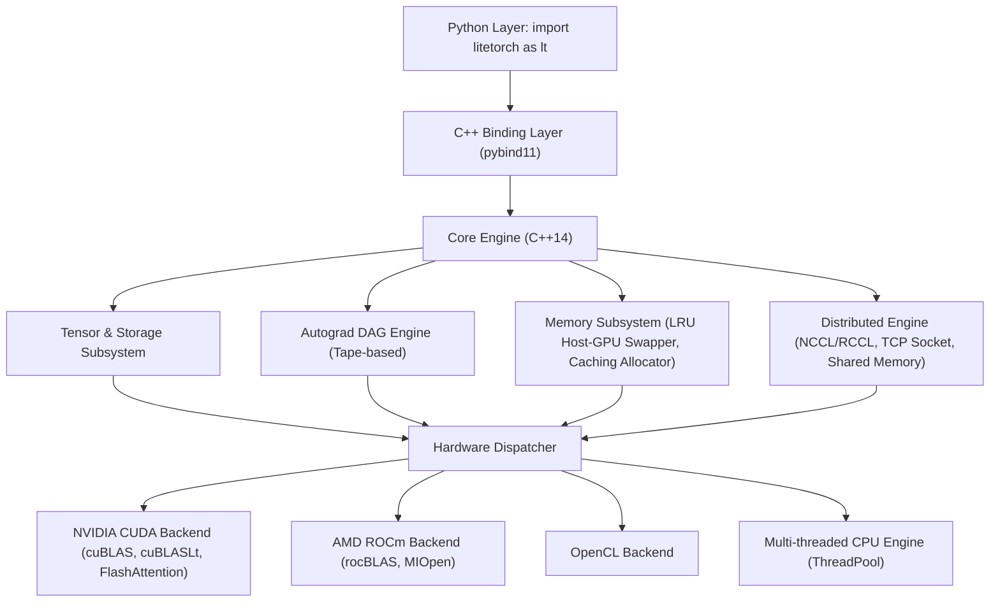

# 1. Tài Liệu Kỹ Thuật LiteTorch

LiteTorch là một framework học sâu (deep learning) và runtime huấn luyện mô hình ngôn ngữ lớn (LLM) hiệu năng cao, được xây dựng hoàn toàn bằng ngôn ngữ C++14 với giao diện lập trình Python thông qua `pybind11`.

Bộ tài liệu này cung cấp hướng dẫn toàn diện từ cơ bản đến chuyên sâu về cách sử dụng, thiết kế mô hình, quản lý bộ nhớ, huấn luyện phân tán 4D và phục vụ suy luận LLM trên LiteTorch.

---

## 1.1. Mục Lục Tài Liệu

| Số thứ tự | Tên tài liệu | Tên file | Mô tả chi tiết |
| :--- | :--- | :--- | :--- |
| 1 | Tổng Quan Tài Liệu | [1.index.md](1.index.md) | Kiến trúc tổng thể, mục lục điều hướng và triết lý thiết kế |
| 2 | Hướng Dẫn Cài Đặt | [2.installation.md](2.installation.md) | Cài đặt trên Linux, Windows, Google Colab, GPU CUDA/ROCm và biên dịch mã nguồn |
| 3 | Bắt Đầu Nhanh | [3.quickstart.md](3.quickstart.md) | Hướng dẫn nhanh quy trình khởi tạo tensor, tính đạo hàm, xây dựng mạng và huấn luyện |
| 4 | Tensor Và Autograd | [4.tensor_and_autograd.md](4.tensor_and_autograd.md) | Kiến trúc bộ nhớ StorageImpl, Device, kiểu dữ liệu, Strides và cơ chế Autograd DAG |
| 5 | Danh Mục Toán Tử | [5.operators.md](5.operators.md) | Tra cứu chi tiết toàn bộ các toán tử tính toán trong `litetorch.Ops` |
| 6 | Mạng Nơ-ron | [6.neural_networks.md](6.neural_networks.md) | Các module mạng: Linear, Conv2d/3d, MoELinear, QLoRA, Attention, Transformer, Loss |
| 7 | Bộ Tối Ưu Hóa & AMP | [7.optimizers_and_amp.md](7.optimizers_and_amp.md) | Thuật toán tối ưu (SGD, AdamW, 8-bit, FP8, ZeRO-3) và Automatic Mixed Precision |
| 8 | Huấn Luyện Phân Tán | [8.distributed_training.md](8.distributed_training.md) | Song song hóa 4D: FSDP (ZeRO-3), Tensor Parallelism, Pipeline 1F1B, Context Parallelism |
| 9 | LLM Serving & Suy Luận | [9.llm_serving.md](9.llm_serving.md) | PagedAttention, Continuous Batching, KV-Cache, Speculative Engine, Medusa, Guided Decoding |
| 10 | Lượng Tử Hóa & JIT | [10.quantization_and_jit.md](10.quantization_and_jit.md) | Lượng tử hóa W8A8, QATLinear, Calibrator, JIT Tracer và JITFunction |
| 11 | Dữ Liệu & Lưu Trữ | [11.data_and_io.md](11.data_and_io.md) | Dataset, DataLoader, quản lý checkpoint và lưu trữ trạng thái mô hình |
| 12 | Lập Trình Native C++ | [12.cpp_api.md](12.cpp_api.md) | Hướng dẫn tích hợp thư viện LiteTorch trực tiếp vào các dự án C++ độc lập |

---

## 1.2. Kiến Trúc Hệ Thống

---

## 1.3. Đặc Điểm Nổi Bật

1. **Hiệu năng cao, loại bỏ độ trễ Python GIL**: Toàn bộ logic tính toán, cấp phát bộ nhớ và truyền thông phân tán được thực thi ở tầng C++ native.
2. **Tích hợp sẵn các hạt nhân (kernels) LLM hiện đại**: FlashAttention, Grouped-Query Attention (GQA), Rotary Position Embedding (RoPE), SwiGLU, RMSNorm, PagedAttention.
3. **Mở rộng quy mô phân tán 4D (4D Distributed Parallelism)**:
   - Fully Sharded Data Parallel (FSDP / ZeRO-3)
   - Tensor Parallelism (TP)
   - Pipeline Parallelism (PP 1F1B)
   - Context Parallelism (CP / Ring Attention)
4. **Quản lý bộ nhớ tối ưu**:
   - Bộ cấp phát bộ nhớ khối đệm (Caching Block Allocator).
   - Tự động hoán đổi bộ nhớ LRU giữa RAM máy chủ và VRAM card đồ họa.
   - Kỹ thuật Activation Checkpointing giảm 60% đến 70% dung lượng VRAM khi huấn luyện.
5. **Đa nền tảng phần cứng**: Tự động nhận diện NVIDIA CUDA, AMD ROCm, OpenCL hoặc CPU đa luồng.
