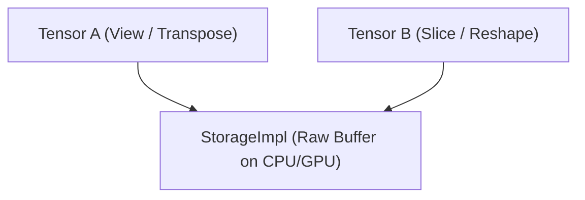

# 4. Kiến Trúc Tensor Và Đạo Hàm Tự Động (Autograd)

Tài liệu này mô tả chi tiết kiến trúc quản lý bộ nhớ của `Tensor`, hệ thống kiểu dữ liệu, phân định thiết bị tính toán và cơ chế đồ thị đạo hàm tự động (Autograd DAG) trong LiteTorch.

---

## 4.1. Tách Biệt Bộ Nhớ: StorageImpl Và Tensor

LiteTorch phân tách rõ ràng giữa vùng nhớ vật lý (`StorageImpl`) và cấu trúc logic đại số (`Tensor`):



- **`StorageImpl`**: Chịu trách nhiệm cấp phát bộ nhớ thô trên CPU (`cpu_data`) hoặc GPU (`gpu_data`), đồng thời kết nối trực tiếp với bộ điều phối `MemoryManager` để thực hiện hoán đổi dữ liệu LRU (Host-Device LRU swap) khi dung lượng VRAM đạt ngưỡng giới hạn.
- **`Tensor`**: Đại diện cho cấu trúc tensor nhiều chiều với các thuộc tính metadata: `shape`, `strides`, `offset`, `dtype`, `device`, cờ theo dõi đạo hàm `requires_grad`, tham chiếu `grad` và nút đồ thị tính toán `creator`.

---

## 4.2. Hệ Thống Kiểu Dữ Liệu (Data Types)

LiteTorch cung cấp đầy đủ các định dạng số thực, số nguyên và số lượng tử hóa trong `lt.DataType`:

| Kiểu dữ liệu | Dung lượng (Byte) | Ứng dụng chính |
| :--- | :--- | :--- |
| `lt.DataType.FP64` | 8 | Tính toán số học khoa học độ chính xác kép |
| `lt.DataType.FP32` | 4 | Chuẩn huấn luyện mặc định |
| `lt.DataType.FP16` | 2 | Huấn luyện Half-Precision tiết kiệm bộ nhớ |
| `lt.DataType.BF16` | 2 | Huấn luyện LLM với dải giá trị động rộng |
| `lt.DataType.INT16` | 2 | Dữ liệu số nguyên 16-bit |
| `lt.DataType.INT8` | 1 | Lượng tử hóa Int8 |
| `lt.DataType.INT4` | 0.5 | Nén trọng số 4-bit |
| `lt.DataType.FP8_E4M3` | 1 | Huấn luyện FP8 chuẩn NVIDIA Hopper/Blackwell |
| `lt.DataType.FP8_E5M2` | 1 | Huấn luyện FP8 mở rộng cho gradient |
| `lt.DataType.NF4` | 0.5 | Chuẩn NormalFloat4 cho QLoRA |
| `lt.DataType.FP4_E2M1` | 0.5 | Chuẩn NVFP4 E2M1 cho NVIDIA Blackwell B200 |

Chuyển đổi kiểu dữ liệu bằng hàm `.cast()`:

```python
import litetorch as lt

device = lt.auto_device()
x = lt.Tensor.from_vector([1.0, 2.0, 3.0, 4.0], [2, 2], device, False, lt.DataType.FP32)
x_half = x.cast(lt.DataType.FP16)
print("Kieu du lieu moi:", x_half.dtype)
```

---

## 4.3. Thiết Bị Tính Toán (Device)

LiteTorch hỗ trợ 3 loại thiết bị:

- `lt.DeviceType.CPU`: Tính toán trên CPU thông qua đa luồng native ThreadPool.
- `lt.DeviceType.GPU`: Tính toán trên card đồ họa (NVIDIA CUDA, AMD ROCm hoặc OpenCL).
- `lt.DeviceType.META`: Thiết bị ảo không cấp phát bộ nhớ, dùng để tính toán kích thước tham số và topology phân tán trước khi nạp trọng số thực.

```python
import litetorch as lt

cpu_dev = lt.Device(lt.DeviceType.CPU, 0)
gpu_dev = lt.Device(lt.DeviceType.GPU, 0)

x_cpu = lt.Tensor.from_vector([1.0, 2.0], [2], cpu_dev, False)
x_gpu = x_cpu.to(gpu_dev)
```

---

## 4.4. Strides, View Và Tính Liên Tục (Contiguity)

LiteTorch hỗ trợ các phép biến đổi hình dạng mà không cần sao chép bộ nhớ nhờ cơ chế bước nhảy (Strides):

```python
import litetorch as lt

device = lt.auto_device()
x = lt.Tensor.from_vector([1.0, 2.0, 3.0, 4.0, 5.0, 6.0], [2, 3], device, False)

print("Kich thuoc ban dau:", x.shape)
print("Strides ban dau:", x.strides)

x_transposed = x.transpose(0, 1)
print("Kich thuoc sau transpose:", x_transposed.shape)
print("Strides sau transpose:", x_transposed.strides)

x_contiguous = x_transposed.contiguous()
print("Strides lien tuc:", x_contiguous.strides)

x_view = x.view([3, 2])
print("Kich thuoc view:", x_view.shape)
```

---

## 4.5. Cơ Chế Autograd DAG Engine

LiteTorch xây dựng đồ thị có hướng không chu trình (DAG) trong quá trình forward pass.

### 4.5.1. Nút Đồ Thị (Node) Và SavedTensor
- Mỗi phép toán tạo ra một `Node` C++ lưu trữ các hàm tính đạo hàm ngược `backward()`.
- Các tensor trung gian phục vụ lan truyền ngược được bọc trong cấu trúc `SavedTensor`, sử dụng con trỏ yếu `std::weak_ptr<Tensor>` để ngăn chặn hiện tượng rò rỉ bộ nhớ do tham chiếu vòng.

### 4.5.2. Tính Đạo Hàm Bậc Nhất

```python
import litetorch as lt

device = lt.auto_device()

x = lt.Tensor.from_vector([2.0, 3.0], [2], device, True)
w = lt.Tensor.from_vector([4.0, 5.0], [2], device, True)

y = lt.Ops.mul(x, w)
loss = lt.Ops.sum(y)

loss.backward()

print("Dao ham x.grad:", x.grad.to_vector())
print("Dao ham w.grad:", w.grad.to_vector())
```

### 4.5.3. Tính Đạo Hàm Bậc Cao (Higher-Order Gradients)
Khi truyền `create_graph=True` vào lệnh `backward()`, các phép tính trong lan truyền ngược tiếp tục được ghi nhận vào DAG:

```python
import litetorch as lt

device = lt.auto_device()

x = lt.Tensor.from_vector([3.0], [1], device, True)
y = lt.Ops.mul(x, x)

y.backward(create_graph=True)
print("Dao ham bac nhat dy/dx:", x.grad.to_vector())
```

### 4.5.4. Đăng Ký Backward Hook

```python
import litetorch as lt

device = lt.auto_device()

x = lt.Tensor.from_vector([1.0, 2.0], [2], device, True)

def custom_hook(grad):
    scale = lt.Tensor.from_vector([2.0, 2.0], [2], device, False)
    return lt.Ops.mul(grad, scale)

x.register_hook(custom_hook)

y = lt.Ops.sum(x)
y.backward()

print("Dao ham sau hook:", x.grad.to_vector())
```

---

## 4.6. Quản Lý Bộ Nhớ & Caching Allocator

LiteTorch tích hợp hệ thống quản lý bộ nhớ đệm (Caching Allocator) tối ưu hóa cho cả CPU và GPU:
- **`lt.empty_cache()`**: Dọn dẹp các khối bộ nhớ đệm không sử dụng và trả lại trang RAM / VRAM cho hệ điều hành.
- **`lt.set_max_cpu_cache_size(bytes)`**: Thiết lập trần dung lượng cache tối đa trên RAM máy chủ (mặc định 128MB).
- **`lt.get_cached_cpu_bytes()`**: Kiểm tra dung lượng RAM đang được giữ trong cache.
- **`lt.get_cached_gpu_bytes()`**: Kiểm tra dung lượng VRAM đang được giữ trong cache.

```python
import litetorch as lt

# Kiem tra dung luong cache hien tai
print("CPU Cache Bytes:", lt.get_cached_cpu_bytes())

# Gioi han muc cache CPU toi da 256MB
lt.set_max_cpu_cache_size(256 * 1024 * 1024)

# Giai phong toan bo bo nho cache ve he dieu hanh
lt.empty_cache()
```
