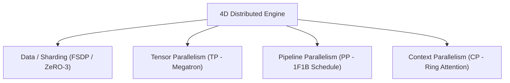

# 8. Huấn Luyện Phân Tán Đa GPU (4D Parallelism)

LiteTorch cung cấp kiến trúc song song hóa 4 chiều (4D Parallelism) hoàn chỉnh, cho phép mở rộng quy mô huấn luyện từ vài GPU đơn lẻ lên tới các cụm hàng nghìn GPU.

---

## 8.1. Tổng Quan Kiến Trúc Song Song Hóa 4D



---

## 8.2. Nhóm Tiến Trình (ProcessGroup) & Rendezvous

Mọi giao tiếp liên GPU được điều phối thông qua `lt.distributed.ProcessGroup`:

```python
import litetorch as lt

pg = lt.distributed.ProcessGroup.get()
pg.init(rank=0, world_size=4, master_addr="127.0.0.1", master_port=29500)

rank = pg.get_rank()
world_size = pg.get_world_size()

print(f"Khoi tao rank {rank} tren tong so {world_size} tien trinh")
```

### 8.2.1. Các hàm nguyên thủy truyền thông (Collective Primitives)
- `all_reduce(tensor)`: Thu gom và tính tổng tensor qua toàn bộ các rank.
- `all_gather(shard, full)`: Gom các mảnh tensor cục bộ thành tensor đầy đủ.
- `reduce_scatter(shard, full)`: Tính tổng tensor đầy đủ và phân mảnh kết quả về từng rank.
- `broadcast(tensor, src)`: Phát sóng tensor từ rank nguồn `src` tới tất cả các rank.
- `send_tensor(tensor, dst)` / `recv_tensor(tensor, src)`: Giao tiếp điểm-điểm (P2P).

---

## 8.3. Fully Sharded Data Parallel (FSDP / ZeRO-3)

FSDP phân mảnh đồng thời 3 thành phần trên các rank:
1. Trọng số mô hình (Model Parameters)
2. Gradient
3. Trạng thái bộ tối ưu hóa (Optimizer States)

```python
import litetorch as lt

device = lt.auto_device()

raw_model = lt.nn.Sequential([
    lt.nn.Linear(4096, 4096, True),
    lt.nn.GELU(),
    lt.nn.Linear(4096, 4096, True)
])
raw_model.to(device)

fsdp_model = lt.distributed.FullyShardedDataParallel(raw_model)

fsdp_model.gather_parameters()
fsdp_model.shard_parameters()
```

---

## 8.4. Tensor Parallelism (TP)

Song song hóa ma trận theo hàng và cột theo phương pháp Megatron-LM để chia nhỏ một tầng tuyến tính khổng lồ ra nhiều GPU:

```python
import litetorch as lt

device = lt.auto_device()

class TensorParallelMLP(lt.nn.Module):
    def __init__(self, hidden_dim, ffn_dim):
        super().__init__()
        self.col_proj = lt.nn.ColumnParallelLinear(hidden_dim, ffn_dim, True)
        self.gelu = lt.nn.GELU()
        self.row_proj = lt.nn.RowParallelLinear(ffn_dim, hidden_dim, True)

    def forward(self, x):
        h = self.col_proj.forward(x)
        h = self.gelu.forward(h)
        out = self.row_proj.forward(h)
        return out
```

---

## 8.5. Pipeline Parallelism (PP 1F1B Schedule)

Lập lịch One-Forward-One-Backward (1F1B) giảm thiểu tối đa bong bóng pipeline:

```python
import litetorch as lt

device = lt.auto_device()

stage_module = lt.nn.Sequential([
    lt.nn.Linear(1024, 1024, True),
    lt.nn.GELU()
])
stage_module.to(device)

pp_module = lt.distributed.PipelineParallelModule(stage_module)

mb1 = lt.Tensor.from_vector([1.0] * 1024, [1, 1024], device, False)
mb2 = lt.Tensor.from_vector([2.0] * 1024, [1, 1024], device, False)
microbatches = [mb1, mb2]

outputs = pp_module.schedule_1f1b(microbatches)
```

---

## 8.6. Context Parallelism (CP / Ring Attention)

Phân đoạn chuỗi ngữ cảnh token dài ra nhiều card GPU và trao đổi Key-Value xoay vòng theo hình xuyến:

```python
import litetorch as lt

device = lt.auto_device()
pg = lt.distributed.ProcessGroup.get()

q = lt.Tensor.from_vector([0.1] * 512, [1, 4, 128, 1], device, True)
k = lt.Tensor.from_vector([0.2] * 512, [1, 4, 128, 1], device, True)
v = lt.Tensor.from_vector([0.3] * 512, [1, 4, 128, 1], device, True)

attn_out = lt.Ops.ring_attention(q, k, v, pg)
```

---

## 8.7. DeviceMesh & Phân Tán Tensor Tự Động (DTensor)

```python
import litetorch as lt

mesh = lt.distributed.DeviceMesh([2, 2], "tp,dp")

placement_shard = lt.distributed.Placement()
placement_shard.type = lt.distributed.PlacementType.SHARD
placement_shard.dim = 0

local_data = lt.Tensor.from_vector([1.0, 2.0, 3.0, 4.0], [2, 2], lt.auto_device(), False)
dtensor = lt.distributed.DTensor(local_data, mesh, [placement_shard])
```
